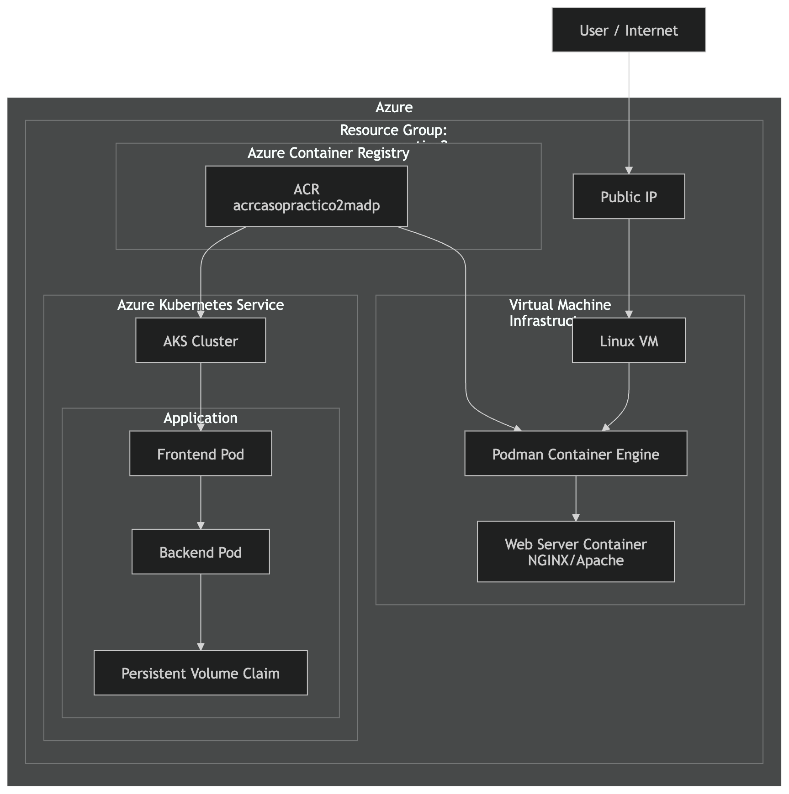
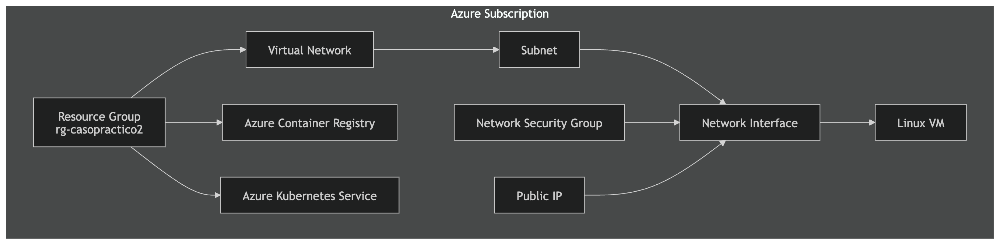

# Terraform + Ansible Deployment on Azure (VM, ACR, AKS)

This project demonstrates the automated deployment of cloud infrastructure and containerized applications on **Microsoft Azure** using **Terraform** and **Ansible**.

The solution provisions infrastructure resources, builds and pushes container images to **Azure Container Registry (ACR)**, and deploys a containerized application into **Azure Kubernetes Service (AKS)**.

---

# Architecture Overview

The infrastructure and application architecture are divided into two layers:

- **Infrastructure Layer** (Terraform)
- **Application Layer** (Kubernetes on AKS)

The deployed application is the **Azure Voting App**, composed of:

- A **Python Flask frontend**
- A **Redis backend**
- Persistent storage using **PersistentVolumeClaim**

---

# Infrastructure Diagram

The infrastructure is provisioned using **Terraform** and includes the following Azure resources:

- Resource Group
- Virtual Network
- Subnet
- Network Security Group
- Public IP
- Network Interface
- Linux Virtual Machine
- Azure Container Registry (ACR)
- Azure Kubernetes Service (AKS)

Infrastructure diagram:

